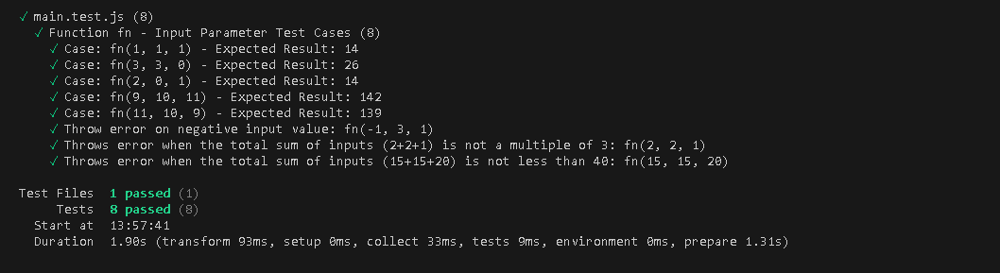

# Dumplings Project 🥟

Hi Geeks! I have made an application where you put the number and type of dumpling you want and you recieve the cheapes prize you have to pay based on an arithmetic average   

## Index 🧾

- [Technologies ⚙](#technologies-)
- [Download ⬇](#download-)
- [Source Code 🔬](#source-code-)
- [Roadmap ❗](#roadmap-)
- [Author 🙍‍♂️](#author-🙍‍♂️)
- [Time of development ⌛](#time-of-development-)


## Technologies ⚙


## Download ⬇

Enjoy yourself with this project in your local storage adding this command in your terminal

```sh
git clone https://github.com/FRR95/ProyectoEmpanadas.git
```

You can see my commits in this url:

> [https://github.com/FRR95/ProyectoEmpanadas/commits/main/]

## Source Code 🔬

**JS**
> [https://github.com/FRR95/ProyectoEmpanadas/blob/main/main.js]


```sh
export const fn = (a, b, c) => {
   // )||(a < 0 || b < 0 || c < 0)||((a + b + c) % 3 != 0
    let res = 0;//Declaring the result of the operation
    if (((a + b + c) > 39)||(a < 0 || b < 0 || c < 0)||((a + b + c) % 3 != 0)) { ///If the Sum of the three values is more than 39 or one of the three values is negative (less than zero) or the sum of the three numbers is not divisible by three (module 3 is not equal 0)
      console.log("Lo sentimos,el numero de empanadas no debe superar 39");///Print Error message via console
        throw error();/////Throwing error to vitest
    }
  
    else {//////////If none of the previous conditions are true the operation can be done 
        res = Math.ceil(((a * 12) + (b * 14) + (c * 16)) / 3); ////Math.ceil method in case of decimal number result,round that one,each number of meals with their own prize added together and divided by the number of values (arithmetic average)
       console.log(res);///Print Result via console
        return res;///Print Result to vitest
    }
};

let arrayEmpanadas = [1, 1, 1]; /////Declaring the array with the values

fn(...arrayEmpanadas);//Calling the action with rest parameter
```

**VITEST**
> [https://github.com/FRR95/ProyectoEmpanadas/blob/main/main.test.js]

```sh
import { fn } from "./main.js";

describe("Function fn - Input Parameter Test Cases", () => {
   test("Case: fn(1, 1, 1) - Expected Result: 14", () => {
      const result = fn(1, 1, 1);
      expect(result).toBe(14);
   });

   test("Case: fn(3, 3, 0) - Expected Result: 26", () => {
      const result = fn(3, 3, 0);
      expect(result).toBe(26);
   });

   test("Case: fn(2, 0, 1) - Expected Result: 14", () => {
      const result = fn(2, 0, 1);
      expect(result).toBe(14);
   });

   test("Case: fn(9, 10, 11) - Expected Result: 142", () => {
      const result = fn(9, 10, 11);
      expect(result).toBe(142);
   });

   test("Case: fn(11, 10, 9) - Expected Result: 139", () => {
      const result = fn(11, 10, 9);
      expect(result).toBe(139);
   });

   test("Throw error on negative input value: fn(-1, 3, 1)", () => {
      expect(() => fn(-1, 3, 1)).toThrow();
   });

   test("Throws error when the total sum of inputs (2+2+1) is not a multiple of 3: fn(2, 2, 1)", () => {
      expect(() => fn(2, 2, 1)).toThrow();
   });

   test("Throws error when the total sum of inputs (15+15+20) is not less than 40: fn(15, 15, 20)", () => {
      expect(() => fn(15, 15, 20)).toThrow();
   });
});
```
***The project passes all the tests:***




**PACKAGE.JSON**
[https://github.com/FRR95/ProyectoEmpanadas/blob/main/package.json]
```sh
{
  "name": "empanadas-challenge",
  "version": "1.0.0",
  "type": "module",
  "description": "Desafío de programación para resolver un problema de optimización para minimizar el gasto al comprar empanadas. Se incluye una descripción detallada del problema y se proporcionan casos de prueba.",
  "main": "main.js",
  "scripts": {
    "start":"node main.js",
    "test": "vitest"
  },
  "keywords": [
    "javascript",
    "challenge",
    "exercise",
    "programación",
    "testing"
  ],
  "author": "Fidel Gilart",
  "license": "ISC",
  "devDependencies": {
    "vitest": "^1.0.4"
  }
}
```
***Start inserted in the script to shorten the execution command ```node main.js```***
## Roadmap ❗

- **Install NodeJs on your computer to run this aplication** Use this url to download it [https://nodejs.org/en]
- **Install all the dependencies** Use the command ```npm install``` in your console
- **Test the application** Use the command ```npm run test``` in your console
- **Start the appllication** Change the ```let arrayEmpanadas = [1, 1, 1]; ```(Chicken,meat and vegetarian respectively)and use the command ```npm start``` in your console to run the application and see the results


## Author 🙍‍♂️

- **Francisco Rocher Roure** - FullStack Developer
  - [GitHub](https://github.com/FRR95) - [LinkedIn](https://www.linkedin.com/in/franciscorocher/) - [Portfolio](https://franciscorocherdev.com/)


## Time of development ⌛

- One Week